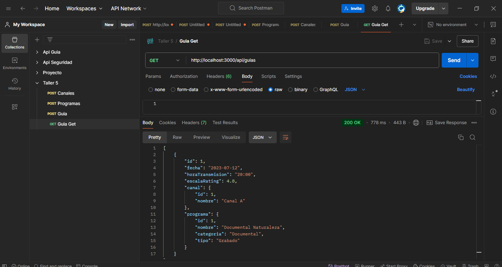

# Proyecto GUIA TV

## Descripción
Permite a los usuarios registrar y consultar información sobre canales y programas.
Este proyecto implementa una API REST para gestionar guías utilizando Node.js, TypeScript y TypeORM. 

## Cambios
- Se configuró TypeORM para conectarse a una base de datos PostgreSQL.
- Se crearon las entidades `Canal`, `Programa` y `Guia`.
- Se implementó un DTO para validar los datos de entrada en las guías.
- Se establecieron controladores y rutas para manejar las operaciones CRUD de las guías.

## Uso
- **GET http://localhost:3000/api/guias**: Obtiene todas las guías.
- **POST http://localhost:3000/api/guias**: Crea una nueva guía.

 Requiere un cuerpo con `canalId`, `programaId`, `fecha`, `horaTransmision` y `escalaRating`

## Img

- Me faltó el Datasource, no lo pude completar por el tema energetico